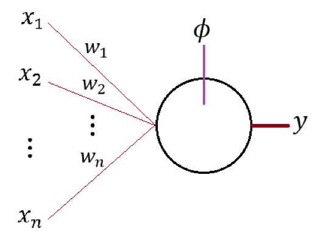
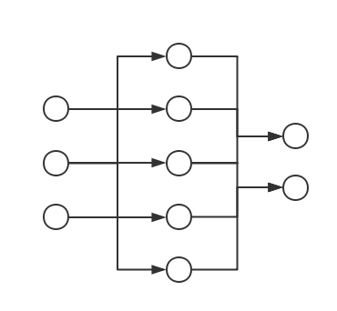
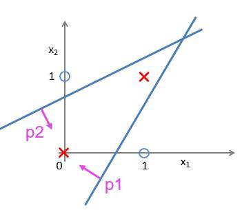
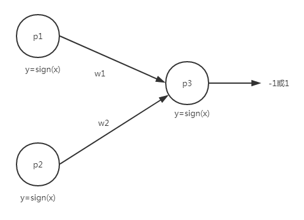
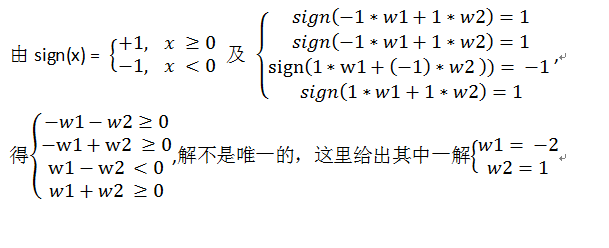
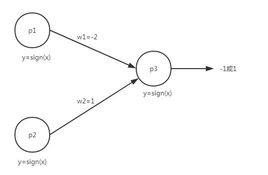
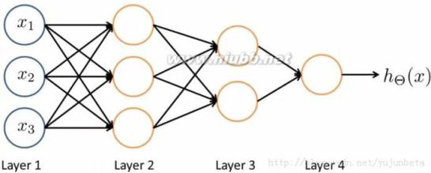
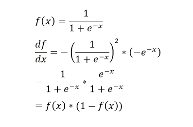

# 定义

人体的神经网络的基本单位是神经元，而在机器学习中模拟的神经网络是由多个感知机组成的，所以机器学习上的神经网络又称为多层感知机

如图就是一个感知机模型，而多个感知机则会组成一个有向无环图。

# 对比感知机模型
存在什么情况是感知机无法做到的？

如图，我们无法用一条线分开点集，但是可以用两条线分开。

| p1       | p2       | result |
| -------- |:--------:| ------:|
| -1       | -1       | 1      |
| -1       | 1        | 1      |
| 1        | -1       | -1     |
| 1        | 1        | 1      |

试着增加一个神经元p3，把p1和p2的输出作为p3的输入，调整权值w1和w2达到上面表中的结果

开始计算

因此，我们通过三个神经元实现了比感知机复杂一点的分类

# 神经网络的分层结构

将输入的数据进行多层的处理，大概是因为这样效率会高吧（我猜的，有待验证）。多层还有个原因就是我们上面举的例子，通过三个神经元组成的两层神经网络来模拟两条线的分类，而有些分类问题复杂到要用两层以上的神经元来模拟。

通俗地理解层的作用：
把输入的数据集作为第一层，第二层从第一层的数据中学习，学习指的就是观察数据的特征，如果第二层有n个神经元，则最多可以观察到数据的n个特征。

而第三层则去观察第二层得到的数据的特征，并将其再次分类。即有些特征往往一起出现的则归为同一类，而有些特征是互斥的则归为不同类。这样的话，第三层又在第二层的基础上学到了新的东西。而分类的实际过程就是不断地去修改神经元之间连线的权值。

也可以去看知乎上的[这个问题](https://www.zhihu.com/question/22553761)

# 思路
## 计算过程类似于感知机的计算思路

找出损失函数，再使用梯度下降法，对其求导然后慢慢接近极小点。

不同点就是一个简单的感知机y = wx + b，我们最终的损失函数只要对w，b求导，然后再更新w和b。

而神经网络的损失函数是和这个神经网络中的全部神经元的连线的权值w和每一层的b相关的，所以求梯度的时候也就是对损失函数求导的时候是分别对这些w和b求导，再去更新这些值。

神经网络里有前向传导算法和反向传播算法，这两个结合使用来实现优化。

前向传导算法就是整个神经网络的权值都设定好，把数据一层一层地计算直到最后，计算在这种权值的设定下的误差
计算过程看[这个](http://www.carefree0910.com/posts/2a8cdd6/)

反向传播算法就是损失函数先对最右边那一层的神经元的权值求导，再更新该层的所有权值。然后从右到左一层一层更新权值。因为这种更新的方向和神经元的传导方向是相反的
计算过程看[这个](http://blog.csdn.net/pennyliang/article/details/6695355)
和[这个](http://blog.csdn.net/zhongkejingwang/article/details/44514073#什么是bp网络)

### 可能要用到的数学知识

[复合函数的求导法则（链式推导）](https://wenku.baidu.com/view/55343587783e0912a3162a05.html)

sigmod函数求导公式

# 相关链接

[从初等数学的角度初探神经网络](http://blog.csdn.net/han_xiaoyang/article/details/50100367)

[前向传导算法](http://www.carefree0910.com/posts/2a8cdd6/)

[反向传播算法](http://blog.csdn.net/pennyliang/article/details/6695355)