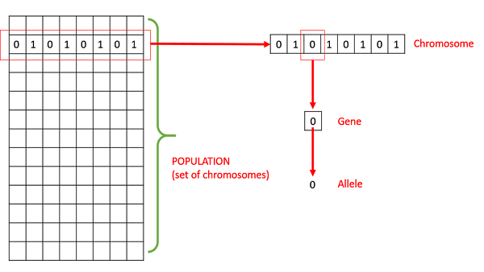

# Basic Terminology(基本术语)

- **人口（Population）** -- 问题所有可能的解的子集

- **染色体（Chromosomes）** -- 问题的其中一个解

- **基因（Gene）** -- 染色体中的一个组成单位

- **Allele** -- 基因的值

- **Genotype** -- Genotype is the population in the computation space(使用Genotype类型的数据来表示人口)

- **Phenotype** -- Phenotype is the population in the actual real world solution space(Phenotype数据是问题的实际解的类型)

- **编码和解码(Decoding and Encoding)** -- 编码就是把问题的一个实际解Phenotype转换成Genotype。解码就是把Genotype转换成实际解Phentype

- **适应函数（Fitness Function）** -- 计算出某个解也就是Chromosomes的适应度。

- **Genetic Operators** --后代染色体的改变操作，包括杂交(crossover), 变异（mutation）, 自然选择（selection）, etc.

# 思路
初始化一个Population，设定好适应函数（Fitness Function）

依据适应度淘汰部分染色体，

剩下的随机杂交，变异，保持Population的染色体数量不变

到达n代之后，选出适应度最高的染色体作为答案

# 问题

1. 编码与解码。把现实生活的问题的一个解转成一串基因组成的染色体

2. 适应度函数。适应度好则表示这个解接近问题实际的解。所以如何判定一个问题的解的好与坏是这个要解决的

# 相关链接

[如何通俗易懂地解释遗传算法？](https://www.zhihu.com/question/23293449)

[Genetic Algorithms - Fundamentals](https://www.tutorialspoint.com/genetic_algorithms/genetic_algorithms_fundamentals.htm)